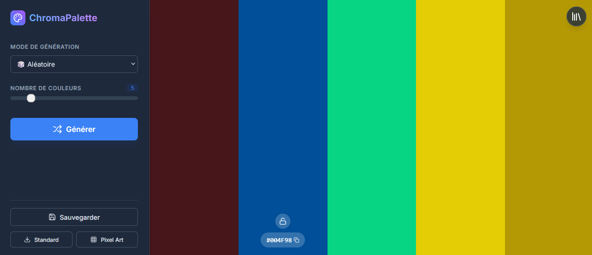

<p align="center">
  
</p>

[](LICENSE)


ChromaPalette est une application minimaliste et rapide permettant de créer, organiser et exporter des palettes de couleurs.  
Elle a été conçue comme un outil simple, efficace et agréable à utiliser pour les développeurs, designers, artistes, ou toute personne manipulant régulièrement des couleurs.
Il est possible d'exporter ses palettes en *.png, mais aussi dans un format pratique pour le pixel-art (8 pixels de hauteur et 8 pixels de largeur par couleur).

---

## ✨ Fonctionnalités

<p align="center">
  
</p>

- Création de palettes personnalisées  
- Ajout, édition et suppression de couleurs  
- Copie rapide des valeurs hexadécimales  
- Aperçu visuel instantané des teintes  
- Export de palettes (normal + format pixel-art) 
- Interface moderne basée sur React + Vite  

## 📁 Structure du projet

```bash
ChromaPalette/
├─ src/
│ ├─ components/
│ ├─ hooks/
│ ├─ styles/
│ ├─ App.jsx
│ └─ main.jsx
├─ public/
├─ package.json
├─ vite.config.js
└─ README.md
```

## 🚀 Installation

### Prérequis

- Node.js ≥ 18  
- npm ou yarn  

### Installation et lancement en développement

```bash
git clone https://github.com/a-langlais/ChromaPalette.git
cd ChromaPalette
npm install
npm run dev
```

L’application sera accessible via l’URL affichée par Vite (généralement http://localhost:3000)

## 🏗️ Build de production

```bash
npm run build
npm run preview
```

## 📄 Licence

Ce projet est sous licence MIT.
Vous êtes libre de l’utiliser, modifier et redistribuer dans les conditions prévues par la licence.
